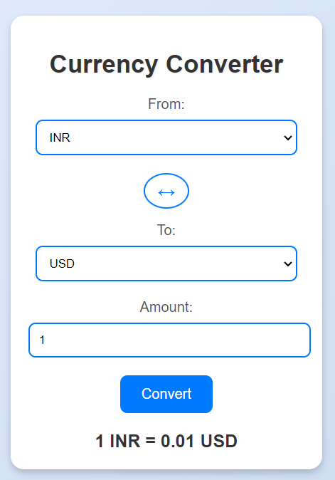

# Currency Converter Extension

The **Currency Converter Extension** is a browser extension designed to help users convert currencies globally with real-time exchange rates. It fetches the latest rates every hour, provides instant updates, and includes features for currency reversal and display of the last updated time.


## Table of Contents

- [Features](#features)
- [Technologies Used](#technologies-used)
- [Usage](#usage)
- [Installation](#installation)
- [Getting the API Key](#getting-the-api-key)
- [Adding the API Key](#adding-the-api-key)
- [Project Structure](#project-structure)
- [Components](#components)
- [Styling](#styling)
- [Extension-Images](#Extension-Images)
- [Contribution](#contribution)

## Features

- **Real-Time Currency Conversion:** Convert between any available global currencies with up-to-date exchange rates.
- **Instant Notifications:** Receive notifications when exchange rates are updated.
- **Reverse Currencies:** Swap the 'From' and 'To' currencies with a simple click using an animated symbol.
- **Last Updated Time:** Display the last updated time of the exchange rates.
- **User-Friendly Interface:** Includes animations and a responsive design for a better user experience.

## Technologies Used

- **HTML:** Provides the structure for the extension’s popup interface.
- **CSS:** Styles the popup with custom animations and responsive design.
  - Animations: Includes hover effects, color changes for buttons, and an animated reverse button.
  - Responsive Design: Ensures the extension looks good on various screen sizes.
- **JavaScript:** Powers the extension’s functionality, including fetching exchange rates, handling user interactions, and updating the UI.
  - Fetch API: Retrieves exchange rates from the Currency API.
  - Event Handling: Manages user inputs and currency reversals.
- **Chrome Extensions API:** Utilized for background tasks, alarms, and notifications.

## Usage

1. **Select Currencies:** Choose the 'From' and 'To' currencies from the dropdown menus.
2. **Enter Amount:** Input the amount you wish to convert.
3. **Convert:** Click the **Convert** button to see the converted amount.
4. **Reverse:** Click the **↔️** button to swap the 'From' and 'To' currencies.
5. **View Last Updated Time:** Check the bottom of the extension popup to see when the rates were last updated.

## Installation

To install the Currency Converter Extension, follow these steps:

1. **Clone the Repository:**

   ```bash
   git clone https://github.com/Bhaswanth67/currency-converter-extension.git
   cd currency-converter-extension
   ```

2. **Load the Extension in Your Browser:**

   - Open Chrome and go to [chrome://extensions](chrome://extensions).
   - Enable **Developer mode** (toggle switch at the top right).
   - Click on **Load unpacked**.
   - Select the directory where you cloned the repository (`currency-converter-extension`).

3. **Configure the API Key:**

   -Open `background.js` and `popup.js`.
   - Replace the placeholder `apiKey` value with your own Currency API key.

## Getting the API Key

To obtain the API key needed for fetching exchange rates:

1. Go to [Currency API](https://app.currencyapi.com/).
2. Sign up for an account if you don't already have one.
3. Log in to your account and navigate to the **API Keys** section.
4. Generate a new API key or use an existing one.

## Adding the API Key

1. Open `background.js` and `popup.js`.
2. Find the line with `const apiKey`.
3. Replace the placeholder `apiKey` value with your own API key from Currency API.

   ```javascript
   const apiKey = 'your_api_key_here';
   ```

## Project Structure

```
CurrencyConverterExtension/
├── icons/
│   ├── icon16.png
│   ├── icon48.png
│   └── icon128.png
├── popup.html
├── popup.css
├── popup.js
├── background.js
├── manifest.json
└── README.md
```

### Components

- **`popup.html`:** The HTML for the extension’s popup interface.
- **`popup.css`:** CSS for styling the popup with animations and responsive design.
- **`popup.js`:** JavaScript for handling user interactions, currency conversion, and updating the UI.
- **`background.js`:** Handles background tasks such as fetching exchange rates, setting alarms, and managing notifications.
- **`manifest.json`:** Configuration file for the Chrome extension.

### Styling

- **CSS:** Styles are written in `popup.css` to create a visually appealing interface with animations and dynamic effects. The styles include:

    ```css
    body {
      font-family: Arial, sans-serif;
      padding: 10px;
      margin: 0;
      width: 300px;
      background-color: #f0f0f0;
    }

    .container {
      text-align: center;
      background-color: #fff;
      padding: 20px;
      border-radius: 10px;
      box-shadow: 0 0 10px rgba(0, 0, 0, 0.1);
    }

    h1 {
      font-size: 24px;
      margin-bottom: 20px;
    }

    .input-group {
      margin-bottom: 15px;
    }

    label {
      display: block;
      margin-bottom: 5px;
    }

    select,
    input {
      width: calc(100% - 12px);
      padding: 8px;
      border: 1px solid #ccc;
      border-radius: 4px;
    }

    button {
      padding: 10px 20px;
      background-color: #007bff;
      color: #fff;
      border: none;
      border-radius: 4px;
      cursor: pointer;
      transition: background-color 0.3s ease, transform 0.3s ease;
    }

    button:hover {
      background-color: #0056b3;
      transform: scale(1.05);
    }

    .reverse-container {
      margin: 10px 0;
      display: flex;
      justify-content: center;
      align-items: center;
    }

    .reverse-btn {
      width: 30px;
      height: 30px;
      border: 2px solid #007bff;
      border-radius: 50%;
      display: flex;
      align-items: center;
      justify-content: center;
      background-color: #fff;
      color: #007bff;
      font-size: 18px;
      cursor: pointer;
      transition: transform 0.3s ease, background-color 0.3s ease;
    }

    .reverse-btn:hover {
      background-color: #007bff;
      color: #fff;
      transform: rotate(360deg);
    }

    #result {
      margin-top: 20px;
      font-size: 18px;
    }
    ```

## Extension-Images

     


## Contribution

Contributions are welcome! Please [fork the repository](https://github.com/your-username/currency-converter-extension/fork) and submit a [pull request](https://github.com/your-username/currency-converter-extension/pulls) with your changes.

Thank you for using the Currency Converter Extension!

